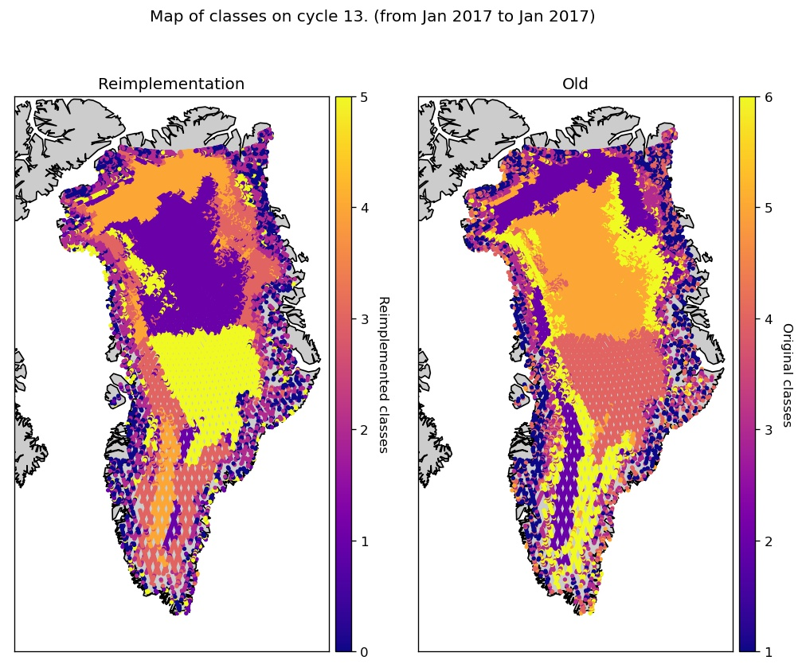

# Remote sensing of Greenland ice sheet surface characteristics using Sentinel 3 satellites

This work is based on:
- Tran, N., Remy, F., Feng, H., & Femenias, P. (2008). Snow facies over ice sheets derived from Envisat active and passive observations. IEEE transactions on geoscience and remote sensing, 46(11), 3694-3708. https://doi.org/10.1109/TGRS.2008.2000818
- Schweisthal, L. (2020) Remote sensing of Greenland ice sheet surface characteristics using Sentinel 3 satellites. MSc. Thesis, DTU Compute. https://doi.org/10.22008/FK2/CNQASU


## Installation

Python prerequisites:
```
conda install netCDF4
conda install shapely
conda install basemap
conda install proj4
conda install basemap-data-hires
conda install -c conda-forge scikit-fuzzy
pip install --upgrade scikit-learn

```

## Fetching data

Firn aquifer and ice slab data (5.6 Gb):

```
bash src/utils/get_data.sh
```

Downloading and processing the S3 catalog (csv files, 700 Mb)

```
bash src/utils/download_catalogue.sh

bash src/utils/process_catalogue.sh
```

Fetching the S3 product:
- if available locally on a eodata folder (e.g. on ESA servers):
```
python process_products.py --fetch_local
```
- Alternatively, download them from ESA's [OData API](https://scihub.copernicus.eu/twiki/do/view/SciHubWebPortal/APIHubDescription). **about 1Tb**
```
python process_products.py --download
```

Requires an account ([see here to register](https://scihub.copernicus.eu/dhus/#/self-registration)). If you download the Sentinel-3 using this project, please read the [Terms and Conditions of Copenicus data hub](https://scihub.copernicus.eu/twiki/do/view/SciHubWebPortal/TermsConditions).

Filters the data (spatial filtering only above Greenland, and icesheet filtering) and create the final hdf files used in the project.
```
python process_products.py
```

## Input parameters
We used 4 customized features: 2 based on the radiometer measurements and 2
from the altimetry measurements. Those features are:
- Average temperature brightness: average of the temperature brightness between the 2 radiometer frequencies (23.8 and 36.5 GHz):

<p align="center"><b>tb<sub><b>avg</b></sub> = (tb<sub>238</sub> + tb<sub>365</sub>)/2</b>.</p>
- Temperature brightness ratio: ratio of temperature brightness between the 2 radiometer frequencies (23.8 and 36.5 GHz):

<p align="center"><b>tb<sub>ratio</sub> = (tb<sub>238</sub>-tb<sub>365</sub>)/(tb<sub>238</sub>+tb<sub>365</sub>)</b></p>
- The backscatter coefficient Sigma 0 for the Ku altimetry band:

<p align="center"><b>σ<sub>Ku</sub></b></p>
- Difference in backscatter (Sigma_0) between the Ku and C band:

<p align="center"><b>Δ<sub>σ</sub> = σ<sub>Ku</sub> - σ<sub>C</sub></b></p>

Note that the original paper worked with Envisat data where S band was used instead of C band.

Maps of input parameters:


## Facies classification

Cluster definition:


Maps of original classes:


Maps of reimplemented classes:



